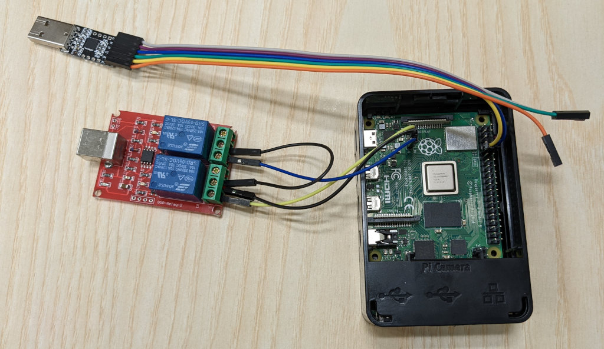

# Using Novaboot with Raspberry Pi

This document describes how to use Novaboot with Raspberry Pi 4B
(RPi).

> :warning: This is work in progress.

First, you need to setup the hardware – connect a serial line and
remote reset. A possible setup can be seen in the figure below.

- You need to enable serial port in the bootloader (U-Boot).

  Update rpi-eeprom to the newest version

  Run `rpi-eeprom-config --edit`.

  Change `BOOT_UART` to `1`.

<!-- // Add BOOT_ORDER=0xf12 (see https://www.raspberrypi.com/documentation/computers/raspberry-pi.html#BOOT_ORDER) -->

- Connect USB-TTL-UART converter to the connector pins 8, 9, 10 (TXD0, GND, RXD0).

- Put U-Boot bootloader to the SD card

  Compile U-Boot:

        make rpi_arm64_defconfig
        make CROSS_COMPILE=aarch64-unknown-linux-gnu- -j8
        cp u-boot.bin ...

   config.txt - add to `[pi4]` section:

        kernel=u-boot.bin
        arm_64bit=1
        enable_uart=1

- Remote reset (and power on/off) can be controlled with an
  USB-controlled relay connected to pins RUN and GLOBAL_EN.
